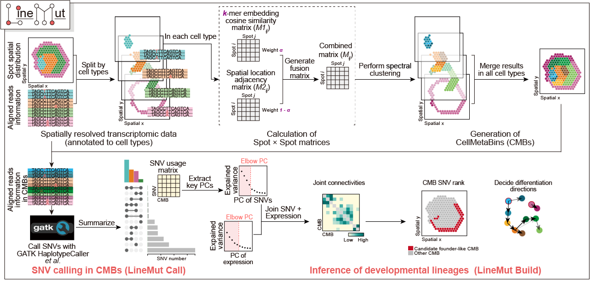

<div align="center">
    <h1>
    Welcome to LineMut!
    </h1>
    <p>
     LineMut is an open-source pipeline for expressed SNV detection and lineage inference from scRNA-seq and spatial transcriptomics data.
    </p>
</div>

****

<div align="center">
     
</div>

## Installation
To use LineMut (v0.2.0), first clone this repository:  

```bash 
git clone https://github.com/RuiyingChenBioinfo/LineMut_v0.2.0.git
```

Create and activate a conda environment with the dependencies required to run LineMut:

```bash
cd LineMut_v0.2.0/
conda create -n linemut_env --file ./conda_env.txt
conda activate linemut_env
```

LineMut Call depends on [GATK4](https://gatk.broadinstitute.org/hc/en-us). Please ensure that GATK4 is installed and available in your environment. You can verify the installation using the following command:  

```bash
gatk --version 
```

Add the cloned local directory to the PATH (optional):  

```bash
echo 'export PATH="'$(pwd)'":$PATH' >> ~/.bashrc
source ~/.bashrc
```

## Usage  

### LineMut Call

LineMut Call detects SNVs from scRNA-seq or spatial transcriptomics data using the command-line program `linemut_call`.

```bash
linemut_call [OPTIONS]
```
    
```
Description:
    linemut_call is designed for detecting expressed single-nucleotide variants
    from single-cell RNA-sequencing or spatial transcriptomics data.

Options:
    --bam, -I:
        Raw BAM file.
    --ref, -R:
        The reference genome sequence file in FASTA format.
    --output, -O:
        Directory for saving the result.
    --barcode-celltype-mapping, -m:
        The CSV file containing cell barcodes and their corresponding cell types.

    --cells-coordinate, -c:
        (optional) The CSV file containing cell coordinate information. If this
        parameter is not provided, the default behavior is to use cell type as
        the unit for mutation detection without CMB partitioning.
    --known-variants-dir, -v:
        (optional) A directory of VCF-formatted known variant sites for the species.
    --k-mer, -k:
        (optional) The length of k-mer, default: 9.
    --cell-barcode-tag, -t:
        (optional) The tag name denoting the cell barcode in the BAM file
        defaults to 'CB'.
    --python:
        (optional) The pathname to the Python interpreter you want to use.
        By default, it uses the first 'python3' found in the PATH.
    --gatk:
        (optional) The pathname of the GATK4 executable file. By default,
        search for 'gatk' in the PATH.
    --samtools:
        (optional) The path to the samtools executable. By default, the first
        'samtools' found in PATH is used.
    --caller-merge-strategy:
        (optional) Strategy for merging SNV calls from multiple variant callers.
        Allowed values: 'major' and 'union'. Default: 'major'.
        'major' classifies SNVs supported by at least two callers as trusted.
        'union' classifies SNVs detected by any caller as trusted.
        This option is applied to the final integration of FreeBayes, Strelka2,
        and GATK results.

    --help, -h:
        Print this message and exit.
```

### LineMut Build

LineMut Build reconstructs lineage relationships using built-in functions. Please refer to the [linemut-tutorial](https://ruiyingchenbioinfo.github.io/LineMut_tutorialv0.1.0/) for detailed instructions on LineMut Build.

## Contact

* Ruiying Chen (陈睿颖), <chenruiying@genomics.cn>
* Chao Qin (秦超), <qinchao@genomics.cn>
* Hai-Xi Sun (孙海汐), <sunhaixi@genomics.cn>

<details>
<summary>Note about package development</summary>

LineMut is actively being developed. You may occasionally encounter bugs or minor documentation issues. GitHub issues are welcome for bug reports, usage questions, and feature suggestions.

</details>